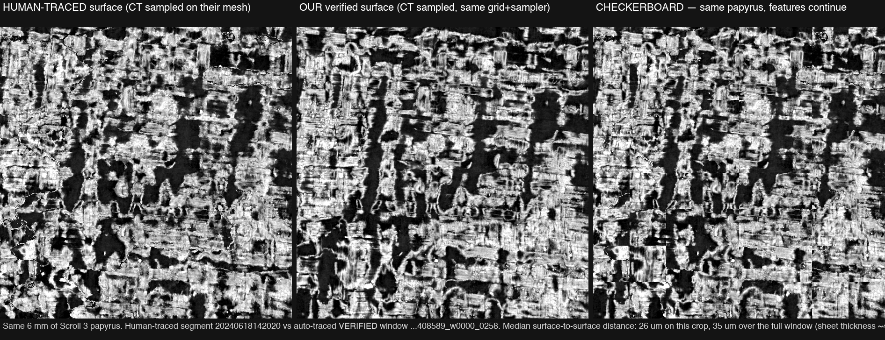
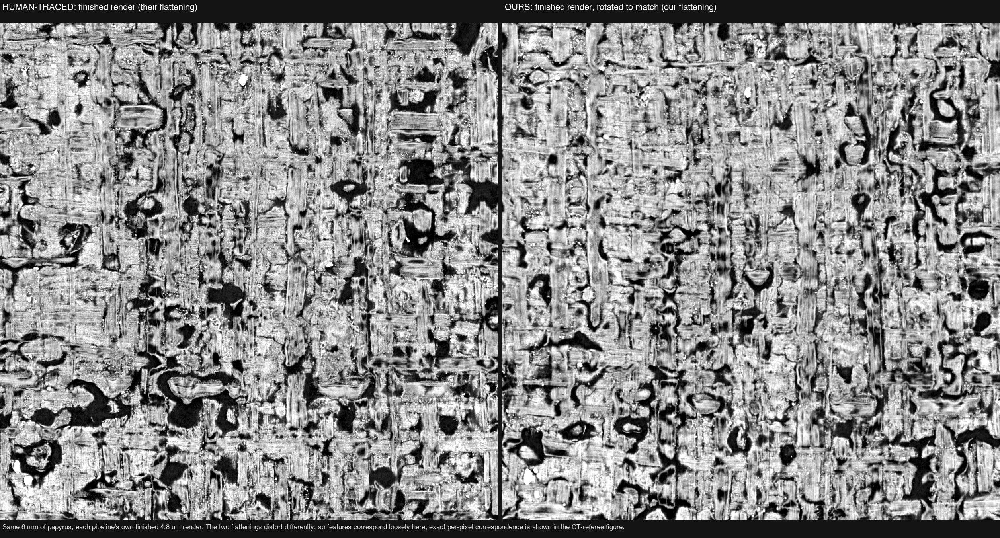
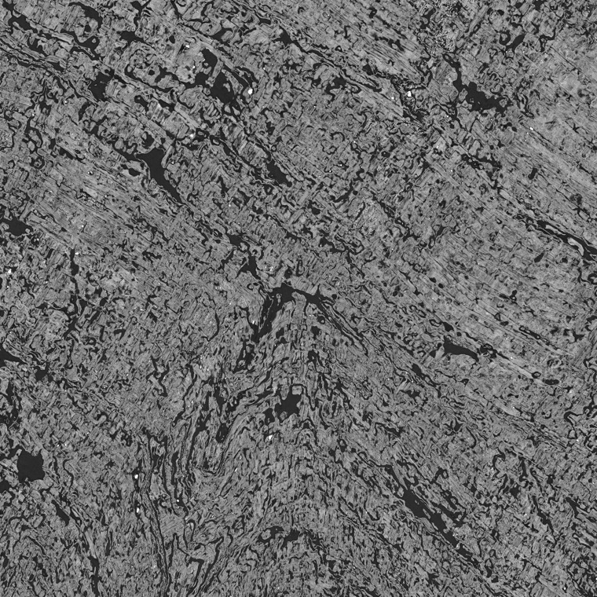
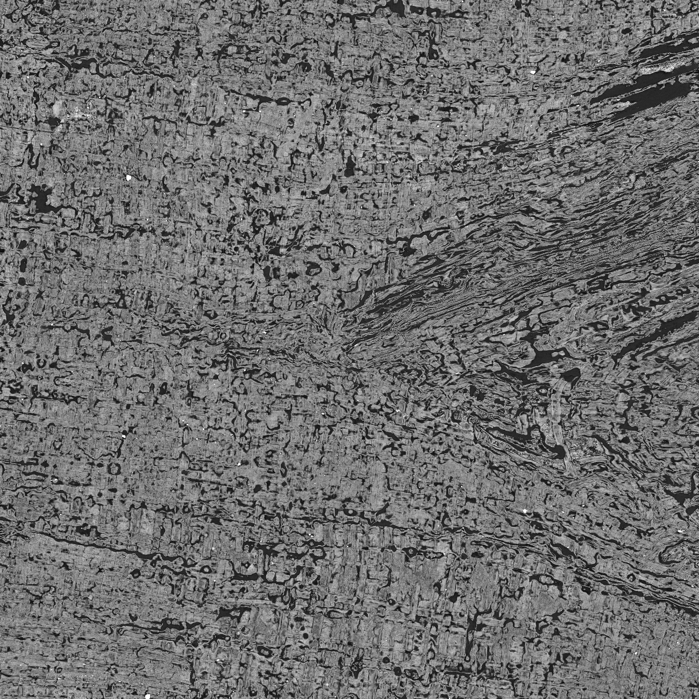
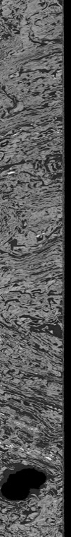
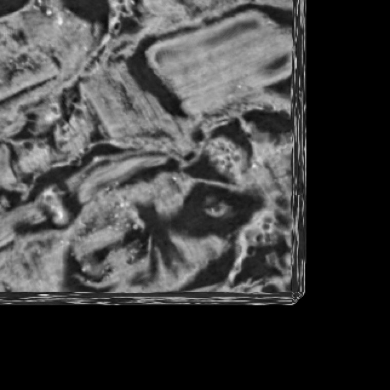

# vesuvius-automesh

Automated, QC-gated surface harvest for Herculaneum scrolls (Vesuvius Challenge).

**Where its output overlaps papyrus that humans already traced, this pipeline re-finds the
human-traced surface to within about one sheet thickness.** Our seed sweep deliberately
avoided the two human-traced Scroll 3 segments, but traces free-grow — and 9 of our 61
verified windows grew onto the same papyrus. The best-overlapped windows track the human
surface at a **median 28–41 µm** (papyrus sheet thickness ≈ 40 µm; the neighboring wrap is
300+ µm away). That is agreement with human ground truth, not just with model predictions —
see [the same-papyrus comparison](#same-papyrus-validated-against-human-tracing) below.

In total: **279.4 cm² of independently verified rendered papyrus surface** (409.3 cm² passed
render-QC; 61 of 106 accepted windows — 68% of accepted area — additionally passed an
independent topology-consistency check, and only that verified area is claimed) —
**~4× the existing human-traced segments** — with **zero manual annotation and zero GPU**,
on a single Apple-silicon Mac streaming CT anonymously from S3. Full engineering writeup:
[WRITEUP.md](WRITEUP.md); per-window QC records: [`qc/`](qc/).

## Same papyrus, validated against human tracing

The same 6 mm of Scroll 3, seen by the human-traced segment (`20240618142020`) and by one of
our verified windows. To compare the two geometries without either pipeline's flattening in
the way, the CT volume is sampled identically on both surfaces, on the same grid — so any
texture difference is purely geometry. In the checkerboard, cracks and fiber weave continue
seamlessly across tiles:



And the two *finished renders* of the same region, each in its own pipeline's flattening
(ours rigidly rotated to match orientation; the flattenings distort differently, so
correspondence here is loose by construction):



Numbers, per overlapping window (`qc/overlap_distance_stats.json`; distances are
nearest-point distances from window vertices to the human mesh, mapped across scans with the
organizers' published old→new transform): 4 windows with the largest overlap track the human
surface at 28–41 µm median; the other 5 sit at 140–200 µm, which we do **not** claim either
way — that is within the uncertainty of the single global affine registering the old scan
(where the human meshes live) to the new 2.4 µm scan.

## What the verified surface looks like

Continuous cross-hatched papyrus fiber weave — the perpendicular plant-fiber layers of a
real page, with a consistent grain. The black squiggles are cracks and losses (this is
2,000-year-old carbonized papyrus); the bright specks are dense mineral inclusions.



Two more verified windows, with their audit numbers (every accepted window ships a
`qc.json`; all 157 windows — passes and failures — are compiled in [`qc/`](qc/)):

|  |  |
|---|---|
| 6.23 cm², found_fraction 0.989; topology re-gate VERIFIED (cov@50 µm 0.84, mean surface distance 24.1 µm) | 6.22 cm², found_fraction 0.996; topology re-gate VERIFIED (cov@50 µm 0.86, mean surface distance 22.3 µm) |

## What the gate throws out

The tracer, left alone, wanders — so the honesty of the headline number lives in the
rejections. The four failure modes, as the gate sees them:

|  |  |
|---|---|
| **The impostor: a surface cut across the roll.** Fiber-like texture, and it **passed all four texture gates** (from an early smoke test) — but the sweeping concentric bands are the scroll's wrap spiral, not a page. This failure is why the gate is two-part: the surface-lock test scores it 0.36–0.54 vs ≥ 0.9 for real pages. | **Drifted off the sheet: rendering air.** The trace left the papyrus entirely, so the renderer sampled empty space — no weave, no bright sheet-normal intensity band. Fails the band-contrast gate (and surface-lock). |
|  |  |
| **Wrong texture: statistically not a page.** Material is present, but the weave is muddled and directionless — the signature of a surface skimming along papyrus without locking onto one face. Fails the coherence gate (calibrated against human-traced renders). | **Ragged edge: not enough page in the frame.** The texture that exists is genuinely fine — this is a 25 mm window hanging off the end of a trace, only ~56% on claimed surface vs the 60% floor. Rejecting it keeps the area ledger honest. |

Gate definitions and calibration numbers: [TECHNICAL_NOTES.md §5](TECHNICAL_NOTES.md).
Windows that clear all of this then face an **independent topology tier** (winding
consistency, prediction-support density, window-level surface scoring) — 61 of 106
gate-accepted windows survive it, and only those 279.4 cm² are claimed.

## Pipeline

```
m7 preds zarr ──► CT-support masking ──► normal grids ──► seed-swept tracer ──► per-window
 (public S3)      (preds & CT>5)         (vc_gen_          (vc_grow_seg_        66-layer render
                                          normalgrids)      from_seed)          + 2-part QC gate
```

1. `build_supported_preds` — sparse voxel-wise mask of the preds zarr against the
   CT (`preds & (CT > 5)`), producing `preds_supported.zarr` (keeps ~30% of
   positive voxels on Scroll 3; the rest are phantoms).
2. `vc_gen_normalgrids` (villa volume-cartographer) on the supported volume,
   3 slice directions, ~25 min. Not optional: without normal grids the tracer's
   surface energy relaxes across wraps (confirmed by A/B — a no-grids sweep
   produced 235 cm² of traces rejected wholesale by render-QC).
3. `tracer_sweep` — seed-sweep orchestrator around `vc_grow_seg_from_seed`:
   seeds drawn only from CT-supported preds voxels in "good" cubes (off-swirl,
   outside existing traced segments via KD-tree), net-new-area accounting,
   12 concurrent single-core traces. Minutes per patch.
4. `render_tifxyz` / `render_queue` — the tracer's tifxyz output (x/y/z
   coordinate TIFFs on a quad grid) *is already a position grid*: upsample to
   render pitch, derive normals from grid derivatives, recenter, 66-layer render
   in villa layout (`<id>/layers/00..65.tif` + mask + `meta.json` + `qc.json`),
   accepted per 25 mm window under the two-part gate, with a cumulative ledger.

## Why step 1 exists: phantom positives in the public predictions

If you consume the public Scroll 3 m7 surface predictions, read this before anything
else touches them: **~70% of the positive voxels sit where the SAM2-masked CT volume is
exactly 0** — a solid halo ring around the scroll plus end caps. The tracer is CT-blind
and happily rides those phantom shells. The one-line fix used here:
`supported = preds & (CT > 5)` at the source (`build_supported_preds`). Measured numbers
and a 10-line reproduction: [TECHNICAL_NOTES.md §4](TECHNICAL_NOTES.md), filed upstream
as [ScrollPrize/villa#1114](https://github.com/ScrollPrize/villa/issues/1114).


## Install

Requires Python ≥ 3.10. With [uv](https://docs.astral.sh/uv/):

```bash
git clone https://github.com/spencerdavis-tx/vesuvius-automesh
cd vesuvius-automesh
uv venv && source .venv/bin/activate
uv pip install -e .
# optional, only for the legacy welded-mesh path (SLIM flattening):
uv pip install -e '.[mesh]'
```

You also need two villa volume-cartographer binaries (step 0 below):
`vc_grow_seg_from_seed` and `vc_gen_normalgrids`.

## Data layout

Set `VESUVIUS_DATA_ROOT` (called `$DATA_DIR` in the docs) to a directory with
local zarr mirrors. Anything missing locally streams from S3 anonymously (per
`config/level_ledger.json`), but the preds volume and the CT level used for
masking should be local for throughput:

```
$DATA_DIR/
  cache/scroll3/preds_m7.zarr   # mirror of the public m7 preds zarr (L0 at least)
  cache/scroll3/ct.zarr         # mirror of masked CT (level 2 required, level 1 useful)
  automesh/                     # pipeline outputs (created by the tools)
  fragments2um/PHerc0343P/layers/32.png   # QC reference render (data server)
```

Sources (public, anonymous):

- preds: `s3://vesuvius-challenge-open-data/PHerc0332/representations/predictions/surfaces/20251211183505-surface-20260413222639-surface-m7-L2-th0.2.zarr`
- CT: `s3://vesuvius-challenge-open-data/PHerc0332/volumes/20251211183505-2.399um-0.2m-78keV-masked.zarr`
- QC reference: any human-verified 2 µm/px fragment surface render; override with
  `AUTOMESH_QC_REFERENCE=/path/to/layer.png`.

## Reproduce the Scroll 3 harvest

Hardware used: Apple-silicon Mac (CPU only), ~30 GB chunk cache, anonymous S3.
No GPU.

```bash
# 0) Build villa volume-cartographer @ commit 4d0ce2881
#    (https://github.com/ScrollPrize/villa).
#    macOS notes: pass OpenCV_DIR for brew opencv; use a build dir whose path
#    contains NO SPACES (a space broke libbacktrace autoconf and PaStiX for us).
#    Put vc_grow_seg_from_seed on PATH or set VC_GROW_SEG_BIN=/path/to/it.

export VESUVIUS_DATA_ROOT=$DATA_DIR

# 1) CT-supported preds (local copy of preds + CT L2 required, or point at S3)
python -m vesuvius_automesh.build_supported_preds --scroll scroll3 \
    --out "$DATA_DIR/automesh/scroll3/preds_supported.zarr" --ct-threshold 5 --workers 8

# 2) Normal grids on the supported volume (~25 min, 3 slice directions)
vc_gen_normalgrids "$DATA_DIR/automesh/scroll3/preds_supported.zarr" \
    "$DATA_DIR/automesh/scroll3/normal_grids_supported"

# 3) Seed sweep (params: tracer/params_seed_v3.json — step_size 20,
#    generations 200; edit its $DATA_DIR placeholders to your real paths,
#    normal_grid_path -> the grids from step 2)
python -m vesuvius_automesh.tracer_sweep --scroll scroll3 \
    --tgt-dir "$DATA_DIR/automesh/scroll3/patches_v2" \
    --params tracer/params_seed_v3.json --target-net-cm2 600

# 4) Render + harvest daemon (25mm windows, 2-part acceptance, cumulative ledger)
python -m vesuvius_automesh.render_queue --scroll scroll3 \
    --patches-dir "$DATA_DIR/automesh/scroll3/patches_v2" \
    --results-dir results/scroll3/tracer_v2 --workers 5
```

Outputs: villa-layout render dirs (`layers/00..65.tif`, `mask.png`, `meta.json`,
`qc.json` with all gate values + the recenter shift histogram) per 25 mm window,
plus `harvest_ledger.json` (cumulative accepted area) in the results dir.

Performance reference points (observations, not promises): trace ≈ minutes/patch
on one core; the binding render cost was CT-L1 S3 latency, fixed by prefetching
only *surface-touched* chunks per window (a curved sheet's bounding box is ~80%
empty: ~14–20k candidate chunks → ~3.1k fetched; ~10–16 min → ~2.5 min per
window, 48 threads).

## Repo map

| Path | What |
|---|---|
| `vesuvius_automesh/build_supported_preds.py` | CT-support masking (the phantom fix) |
| `vesuvius_automesh/tracer_sweep.py` | seed sweep around `vc_grow_seg_from_seed` |
| `vesuvius_automesh/render_tifxyz.py` | tifxyz → recenter → 66-layer render → QC |
| `vesuvius_automesh/render_queue.py` | render daemon + acceptance ledger |
| `vesuvius_automesh/select_regions.py` | "good cube" selection from the survey maps |
| `vesuvius_automesh/scroll2_seeds.py` | density-weighted Scroll 2 seeding (experimental) |
| `vesuvius_automesh/batch_region.py`, `export_cubes.py`, `flatten*.py`, `mesh_io.py`, `render_driver.py` | legacy scrollfiesta welded-mesh path (superseded by the tracer route) |
| `vesuvius_automesh/_vendor/first_letters/` | vendored render/QC internals (recenter, 66-layer sampler, gates) |
| `config/level_ledger.json` | measured volume/level metadata + S3 prefixes |
| `tracer/params_seed_v3.json` | the tracer params used for the harvest |
| `survey/` | 2026-06-11 preds survey artifacts (cube maps + phantom numbers) |
| `figures/` | phantom-halo overlay, accepted/rejected render examples, same-papyrus comparisons |
| `qc/` | per-window QC records for all 157 windows + human-overlap distance stats |

## Environment variables

| Var | Meaning | Default |
|---|---|---|
| `VESUVIUS_DATA_ROOT` | data dir (`$DATA_DIR`) | `data` |
| `VC_GROW_SEG_BIN` | path to `vc_grow_seg_from_seed` | on `PATH` |
| `AUTOMESH_QC_REFERENCE` | QC reference render (2 µm/px PNG) | `$DATA_DIR/fragments2um/PHerc0343P/layers/32.png` |
| `SCROLLFIESTA_SRC` | scrollfiesta `src/` (legacy mesh path only) | `third_party/scrollfiesta_public/src` |

## License, data attribution

MIT (see LICENSE). Scroll data © EduceLab / The University of Kentucky
(EduceLab-Scrolls, arXiv:2304.02084), used under the Vesuvius Challenge data
agreement. Surface predictions and the tracer/normal-grid tools are the
Vesuvius Challenge team's (villa monorepo). Full citations in
[WRITEUP.md §9](WRITEUP.md). Thanks to the Vesuvius Challenge team for
open-sourcing the entire stack.
