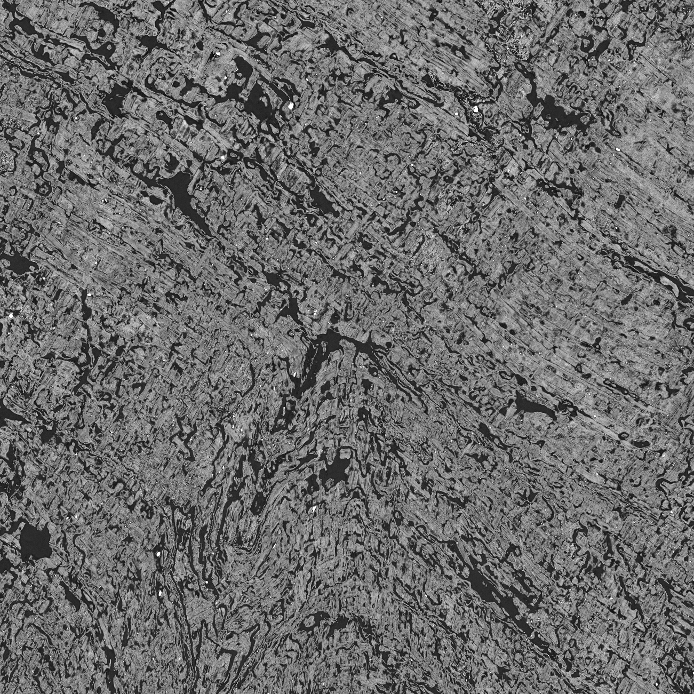
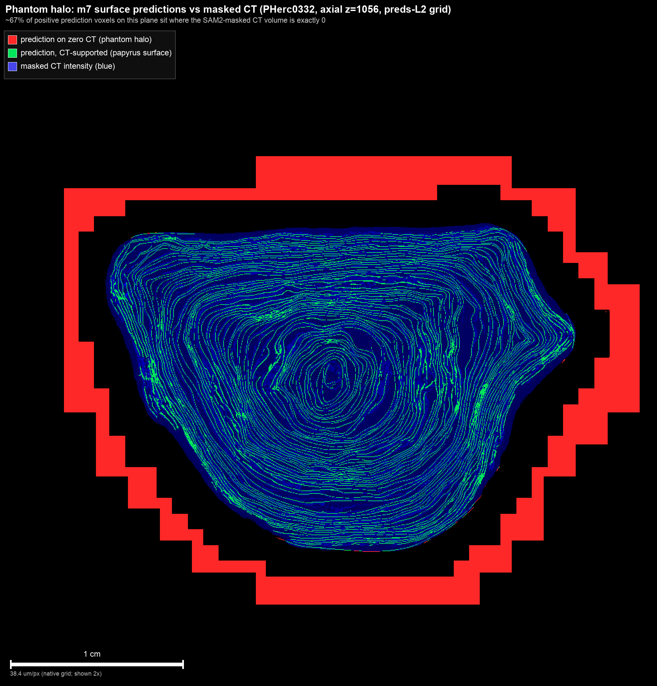

# 409 cm² of Scroll 3 surface, hands-free

*Spencer Davis — July 2026*

After the PHerc. 1667 paper, the picture is pretty clear: ink detection is in decent shape,
and the thing standing between us and the rest of the library is geometry — tracing the
rolled-up sheet, which still costs the team tens of hours of manual annotation per wrap.

So I wanted to know: using only what's already public — the team's Scroll 3 surface
predictions, their tracer, their render conventions — how much usable surface can you
harvest with **zero** human tracing?

The answer turned out to be **409 cm² of QC-passing rendered surface**, about 6× the
human-traced segments currently on the data server for Scroll 3, produced on a Mac CPU
streaming the CT from S3. No GPU, no annotation clicks.

## The idea: harvest, don't trace

The pipeline is the team's own tools in a row — surface predictions → `vc_grow_seg_from_seed`
→ standard 66-layer renders. What I added is glue and one design decision.

The tracer, left alone, wanders. It grows beautiful surfaces for a while and then drifts off
the sheet, and there's no point fighting it patch by patch — that's how you end up doing
manual annotation again. Instead: sweep many seeds, let every trace run, render *everything*
in 25 mm windows, and let a quality gate decide window by window what survives. A wandering
trace wastes some compute, but it can't sneak a bad window past the gate.

From 17 traces: 157 windows rendered, 106 accepted. Seven traces in clean outer-wrap
territory did most of the work; two wandered completely and contributed nothing. That
failure rate is fine — the gate is what makes the number honest, not the tracer.

## The bug I hit on the way (please read this if you use the public predictions)

My first renders came out black, and I spent a while blaming my own code. The actual cause:
**about 70% of the positive voxels in the public Scroll 3 surface-prediction zarr sit where
the published masked CT volume is exactly zero** — a solid halo around the scroll plus end
caps. The predictions and the mask disagree about where the scroll *is*. It's not a Scroll 3
quirk either: PHerc1451, from the same batch run, spot-checks at ~60%.

Where the scan actually has material, the predictions are excellent — this is purely a
background/masking artifact. But the tracer never looks at the CT, so seeded naively it
happily traces those phantom shells (an early trace of mine had 63% of its points in the
halo). The one-line fix that unblocked everything: `supported = preds & (CT > 5)`, applied
before anything else touches the predictions.

Full numbers and a 10-line reproduction are in
[ScrollPrize/villa#1114](https://github.com/ScrollPrize/villa/issues/1114).

## The gate, and the blind spot that made it two-part

I started with four texture/geometry gates calibrated against human-traced renders
(coherence, band contrast, merge fraction, mask fraction). Then a smoke test produced a
render of a scroll **cross-section** — surface cutting straight across the wraps, spiral
plainly visible, obviously garbage — and it *passed all four gates*. Fiber texture is
locally coherent even when the geometry is completely wrong.

The fix is a surface-lock test: during rendering, each probe tries to re-center onto a sheet
along its normal, and I track what fraction succeeds. Real surfaces score 0.97–1.00.
Wandering or cross-cutting traces score 0.36–0.54. The threshold (0.9) sits in the empty
middle, and passing windows land at a median of 0.989. Every window ships with its own
`qc.json`, so you can audit any of this instead of taking my word for it.

## Caveats, honestly

The renders are 4.8 µm — good enough to judge surface quality, not what you'd feed an ink
model (2.4 µm re-renders of the accepted windows are in progress). Thirty percent of the
rendered area failed the gate and was thrown away; some of that is probably recoverable with
the team's fiber-direction techniques. The gate calibration comes from Scroll 3's own
human-traced segments, not from a known-ink control.

**Update (2026-07-05):** further testing on denser, zero-gap terrain (tightly fused wraps)
found a real failure mode of the `found_fraction` gate: where wraps touch with no air gap,
the recenter probe can lock onto *some* sheet almost everywhere, and the gate saturates —
we measured medians above 0.99 even on windows that independent topology checks showed were
crossing between wraps. On terrain like Scroll 3's (calibrated populations well-separated) it
works as described; on fused terrain, treat it as necessary but not sufficient, and add a
topology check (e.g., winding-consistency of the traced surface) before trusting accepted
area. A v2 gate spec is in progress and will be published with a follow-up report. And to be completely clear: **there are
no ink claims here.** This is renderable surface, nothing more.

## If you want to build on it

Everything is in this repo (MIT): the pipeline, configs, a walkthrough in the
[README](README.md), and per-window QC records for all 157 windows — the failures too, which
make a nice labeled set of tracer failure modes if automated segmentation is your thing.
The pipeline doesn't care which scroll it's pointed at; Scroll 2 is the obvious next target.
The exhaustive version of this writeup, with every number and reproduction command, is in
[TECHNICAL_NOTES.md](TECHNICAL_NOTES.md).

## Credit where it's due

Every component consumed here is the Vesuvius Challenge team's, released openly: the scans
(EduceLab-Scrolls, arXiv:2304.02084, © University of Kentucky), the surface predictions and
tracer (the [villa](https://github.com/ScrollPrize/villa) monorepo), and the context that
motivated all of it (Angelotti et al., arXiv:2606.29085, CC BY-NC 4.0). Full citations in
[TECHNICAL_NOTES.md](TECHNICAL_NOTES.md#9-citations-data-attribution-licenses).
